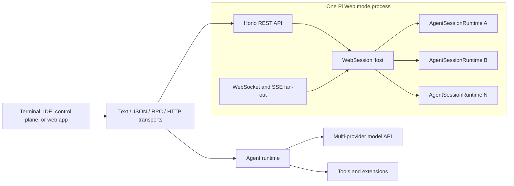

<div align="center">
  <h1>Pi Web</h1>
  <p><strong>An unofficial, Web-focused fork of Pi Agent Harness.</strong></p>
  <p>
    Run Pi interactively, embed it through an SDK or RPC, or serve multiple isolated agent sessions
    from one authenticated HTTP process.
  </p>
  <p>
    <a href="README.zh-CN.md">简体中文</a>
    · <a href="#quick-start">Quick Start</a>
    · <a href="#web-mode">Web Mode</a>
    · <a href="#architecture">Architecture</a>
    · <a href="#development">Development</a>
  </p>
  <p>
    
    
    
  </p>
</div>

---

> **Unofficial fork:** Pi Web is an independent fork of [Pi Agent Harness](https://github.com/earendil-works/pi). It is not affiliated with or endorsed by Mario Zechner or Earendil Works.

Pi Web builds on Pi, a small agent harness with strong defaults and a deliberately open extension model. Pi provides the agent loop, model integrations, session persistence, terminal UI, tools, and transport layers while leaving product-specific workflows to extensions and host applications.

This repository includes a first-class Web mode for control planes and browser-facing products. A single `pi --mode web` process can own multiple sessions, each with its own `AgentSessionRuntime`, message history, model state, working directory, and event stream.

> New issues and pull requests from new contributors are automatically closed for maintainer review. See [CONTRIBUTING.md](CONTRIBUTING.md).

## Highlights

| Area | What Pi provides |
|---|---|
| Coding agent | Built-in `read`, `write`, `edit`, and `bash` tools with streaming model output |
| Model access | Anthropic, OpenAI, Google, Bedrock, OpenRouter, local OpenAI-compatible endpoints, and more |
| Sessions | Persistent histories, branching, forking, compaction, naming, export, and tree navigation |
| Customization | TypeScript extensions, skills, prompt templates, themes, and installable Pi packages |
| Integrations | SDK, JSON events, stdin/stdout RPC, REST, WebSocket, and Server-Sent Events |
| Web concurrency | Multiple independently addressable agent sessions in one Pi process |
| Deployment | Optional Bearer authentication, configurable CORS, prompt rate limiting, and connection heartbeats |

Pi intentionally does not impose a built-in workflow such as subagents or plan mode. Add those capabilities through extensions and skills, or embed the runtime in an application that defines its own workflow.

## Quick Start

### Requirements

- Node.js 22.19 or newer
- An API key, provider subscription, or trusted local model endpoint

### Install Pi Web from source

```bash
git clone https://github.com/Garhorne0813/pi-web.git
cd pi-web
npm ci --ignore-scripts
```

`--ignore-scripts` disables dependency lifecycle scripts; Pi Web does not require them for a normal installation.

Configure a provider and start the interactive agent:

```bash
export ANTHROPIC_API_KEY=sk-ant-...
./pi-test.sh
```

You can also run `/login` inside Pi to authenticate with a supported subscription provider.

## Run Modes

| Mode | Command | Purpose |
|---|---|---|
| Interactive | `pi` or `pi --mode text` | Full terminal UI with sessions, themes, extensions, and keybindings |
| Print | `pi -p "prompt"` | Run one prompt, print the final assistant response, and exit |
| JSON | `pi --mode json "prompt"` | Stream session events as JSON Lines |
| RPC | `pi --mode rpc` | Control Pi through a JSON-Line protocol over stdin/stdout |
| Web | `pi --mode web` | Serve REST APIs plus WebSocket and SSE event streams |

See the [coding-agent guide](packages/coding-agent/README.md), [JSON protocol](packages/coding-agent/docs/json.md), and [RPC protocol](packages/coding-agent/docs/rpc.md) for mode-specific documentation.

## Web Mode

Web mode turns Pi into a local agent service. One process hosts a default session and any number of dynamic sessions created through the API.

### Start the server

```bash
export PI_WEB_AUTH_TOKEN='replace-with-a-long-random-token'
export PI_WEB_CORS_ORIGIN='https://your-control-plane.example'

./pi-test.sh --mode web --host 127.0.0.1 --port 3000
```

| Setting | Default | Description |
|---|---|---|
| `--host`, `PI_WEB_HOST` | `127.0.0.1` | HTTP bind address |
| `--port`, `PI_WEB_PORT` | `3000` | HTTP port, from 1 to 65535 |
| `--auth-token`, `PI_WEB_AUTH_TOKEN` | unset | Process-wide Bearer token |
| `PI_WEB_CORS_ORIGIN` | `*` | Allowed browser origin |

The health endpoint is public. All other `/api/*` routes and the WebSocket upgrade require authentication when a token is configured.

### Create a session and stream events

```bash
BASE_URL=http://127.0.0.1:3000
AUTH_HEADER="Authorization: Bearer $PI_WEB_AUTH_TOKEN"

curl "$BASE_URL/api/health"

SESSION_ID=$(curl -fsS -X POST "$BASE_URL/api/sessions" \
  -H "$AUTH_HEADER" \
  -H "Content-Type: application/json" \
  -d '{"cwd":"/absolute/path/to/project","name":"web session"}' \
  | python3 -c 'import json,sys; print(json.load(sys.stdin)["sessionId"])')

# Keep this request open in another terminal before sending the prompt.
curl -N "$BASE_URL/api/sessions/$SESSION_ID/events" -H "$AUTH_HEADER"
```

Send a prompt:

```bash
curl -fsS -X POST "$BASE_URL/api/sessions/$SESSION_ID/prompt" \
  -H "$AUTH_HEADER" \
  -H "Content-Type: application/json" \
  -d '{"message":"Inspect this project and summarize its architecture."}'
```

The prompt endpoint returns HTTP `202` after prompt preflight succeeds. Generated output and tool events continue through SSE or WebSocket. Preflight failures return an error response instead of being silently accepted.

### Session API

| Method | Path | Purpose |
|---|---|---|
| `POST` | `/api/sessions` | Create a session with optional `cwd` and `name` |
| `GET` | `/api/sessions` | List sessions owned by this process |
| `GET` | `/api/sessions/:id` | Read session metadata |
| `GET` | `/api/sessions/:id/state` | Read model, thinking, streaming, and compaction state |
| `GET` | `/api/sessions/:id/stats` | Read message, token, cost, and context statistics |
| `GET` | `/api/sessions/:id/messages` | Read the current message history |
| `GET` | `/api/sessions/:id/entries?since=<id>` | Read all or incremental session entries |
| `GET` | `/api/sessions/:id/tree` | Read the session branch tree and current leaf |
| `PATCH` | `/api/sessions/:id` | Rename a session with `{ "name": "..." }` |
| `POST` | `/api/sessions/:id/clone` | Clone the current session at its active leaf |
| `POST` | `/api/sessions/:id/restart` | Recreate the runtime while preserving the Web session ID |
| `POST` | `/api/sessions/:id/export` | Export a persisted session to HTML |
| `DELETE` | `/api/sessions/:id` | Dispose a dynamic session |

The startup session is protected from deletion. Use its `restart` endpoint when its runtime must be replaced.

### Agent and model API

| Method | Path | Purpose |
|---|---|---|
| `POST` | `/api/sessions/:id/prompt` | Submit `{ "message": "..." }` |
| `POST` | `/api/sessions/:id/abort` | Abort the active agent run |
| `POST` | `/api/sessions/:id/bash` | Execute a shell command and return its result |
| `POST` | `/api/sessions/:id/compact` | Compact context and return the compaction result |
| `POST` | `/api/sessions/:id/fork` | Fork at an optional `entryId` |
| `GET` | `/api/models?session_id=<id>` | List models with configured authentication |
| `POST` | `/api/sessions/:id/model` | Select `{ "provider": "...", "modelId": "..." }` exactly |
| `POST` | `/api/sessions/:id/thinking` | Set `off`, `minimal`, `low`, `medium`, `high`, or `xhigh` |

Prompt requests are limited per session with a token bucket. The current default is 30 requests per minute.

### Event transports

Use either transport for the same serialized `AgentSessionEvent` stream:

- SSE: `GET /api/sessions/:id/events`
- WebSocket: `GET /ws?session_id=<id>`

WebSocket clients may also submit a prompt command:

```json
{ "type": "prompt", "message": "Run the relevant tests." }
```

Authenticated WebSocket upgrades must carry `Authorization: Bearer <token>` as an HTTP header. Tokens in URL query parameters are rejected. Node clients and command-line clients such as `websocat` can set the header directly:

```bash
websocat -H="Authorization: Bearer $PI_WEB_AUTH_TOKEN" \
  "ws://127.0.0.1:3000/ws?session_id=$SESSION_ID"
```

Native browser `WebSocket` and `EventSource` APIs cannot set arbitrary authorization headers. For authenticated browser deployments, place Pi behind a same-origin backend or reverse proxy that authenticates the user and injects the Pi Bearer header. Do not put the token in browser-visible URLs.

## Architecture



Web mode is a transport layer over the same `AgentSession` used by interactive and RPC modes. `WebSessionHost` owns the process-local session registry; `ConnectionManager` subscribes clients to the correct runtime and rebinds event delivery when a runtime replaces its underlying session.

Session isolation is logical, not an operating-system security boundary. Sessions have separate runtime state but share the Pi process, host credentials, filesystem permissions, and network access.

## Packages

| Package | Description |
|---|---|
| [@earendil-works/pi-ai](packages/ai) | Unified multi-provider LLM API |
| [@earendil-works/pi-agent-core](packages/agent) | Agent loop, tool calling, events, and state management |
| [@earendil-works/pi-coding-agent](packages/coding-agent) | CLI, sessions, tools, extensions, RPC, and Web mode |
| [@earendil-works/pi-tui](packages/tui) | Differential-rendering terminal UI library |

The coding-agent package also exposes an SDK for applications that want to embed Pi without running a transport server. See [SDK documentation](packages/coding-agent/docs/sdk.md).

## Security and Deployment

Pi runs with the permissions of the operating-system user that launches it. The Web token authenticates access to a process; it does not provide per-session authorization or sandbox tool execution.

For production deployments:

- Always configure `PI_WEB_AUTH_TOKEN` with a long random value.
- Bind to localhost unless a trusted network path requires otherwise.
- Terminate TLS and enforce request-size limits at a reverse proxy.
- Set `PI_WEB_CORS_ORIGIN` to the exact control-plane origin.
- Run separate Pi processes or containers for mutually untrusted users.
- Apply CPU, memory, filesystem, and network limits outside Pi.
- Treat the bash endpoint and agent tools as remote code execution within the Pi trust domain.

WebSocket clients are pinged every 30 seconds; connections that stop answering are terminated. Failed event delivery closes the affected connection. The session registry itself is in memory, although sessions configured with persistent `SessionManager` storage can write history to disk.

See [containerization guidance](packages/coding-agent/docs/containerization.md) for Gondolin, Docker, and OpenShell isolation patterns, and read [SECURITY.md](SECURITY.md) before exposing Pi beyond a local trust boundary.

## Development

If you have not completed the [Quick Start](#quick-start), clone the repository and install the pinned workspace dependencies:

```bash
git clone https://github.com/Garhorne0813/pi-web.git
cd pi-web
npm ci --ignore-scripts
```

Common commands:

```bash
npm run check        # Format, lint, dependency checks, and TypeScript checks
./test.sh            # Non-e2e test suite
./pi-test.sh         # Run Pi directly from source
./pi-test.sh --mode web --port 3000
```

Build and full test commands are intentionally separate from `npm run check`:

```bash
npm run build
npm test
```

See [AGENTS.md](AGENTS.md) for repository-specific development rules and [CONTRIBUTING.md](CONTRIBUTING.md) for the contributor gate and review process.

## Supply-Chain Hardening

- Direct external dependencies are pinned to exact versions.
- Installs and CI use `--ignore-scripts` unless lifecycle scripts were explicitly reviewed.
- `package-lock.json` is the dependency ground truth.
- Published coding-agent packages include a generated shrinkwrap for transitive dependencies.
- `npm run check` verifies dependency pinning, TypeScript imports, shrinkwraps, and install locks.
- Release smoke tests install unpublished Node and Bun artifacts outside the repository before tagging.

## Documentation

- [Coding-agent guide](packages/coding-agent/README.md)
- [Web mode protocol](packages/coding-agent/docs/web-mode.md)
- [RPC protocol](packages/coding-agent/docs/rpc.md)
- [Provider configuration](packages/coding-agent/docs/providers.md)
- [Extensions](packages/coding-agent/docs/extensions.md)
- [Skills](packages/coding-agent/docs/skills.md)
- [Containerization](packages/coding-agent/docs/containerization.md)

The upstream Pi website and versioned documentation are available at [pi.dev](https://pi.dev) and [pi.dev/docs/latest](https://pi.dev/docs/latest).

## Contributing

Issues and pull requests are welcome. Changes to runtime behavior should include focused regression tests. Before submitting, run the checks required by [CONTRIBUTING.md](CONTRIBUTING.md).

Longer-term design work is tracked in the [Pi RFCs](https://rfc.earendil.com/keyword/pi/).

## Acknowledgements

Pi Web is built on [Pi Agent Harness](https://github.com/earendil-works/pi), created by [Mario Zechner](https://github.com/badlogic) and maintained by Earendil Works and its contributors.

This fork preserves the upstream MIT license and copyright notice. Pi Web is independently maintained and is not an official Pi distribution.

## License

MIT

See [LICENSE](LICENSE) for the upstream copyright notice and license terms.
