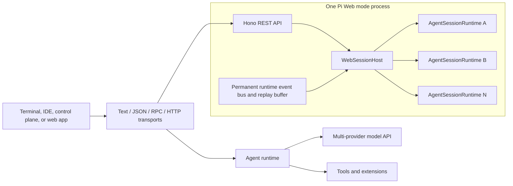

<div align="center">
  <h1>Pi Web</h1>
  <p><strong>An unofficial, Web-focused fork of Pi Agent Harness.</strong></p>
  <p>
    Run Pi interactively, embed it through an SDK or RPC, or serve multiple isolated agent sessions
    from one authenticated HTTP runtime host.
  </p>
  <p>
    <a href="README.zh-CN.md">简体中文</a>
    · <a href="#quick-start">Quick Start</a>
    · <a href="#web-mode">Web Mode</a>
    · <a href="#architecture">Architecture</a>
    · <a href="#development">Development</a>
  </p>
  <p>
    
    
    
  </p>
</div>

---

> **Unofficial fork:** Pi Web is an independent fork of [Pi Agent Harness](https://github.com/earendil-works/pi). It is not affiliated with or endorsed by Mario Zechner or Earendil Works.

Pi Web builds on Pi, a small agent harness with strong defaults and a deliberately open extension model. Pi provides the agent loop, model integrations, session persistence, terminal UI, tools, and transport layers while leaving product-specific workflows to extensions and host applications.

This repository includes a first-class Web mode for control planes and browser-facing products. A single `pi --mode web` process can own multiple logically isolated runtimes, each with its own `AgentSessionRuntime`, message history, model state, working directory, and replayable event stream.

> New issues and pull requests from new contributors are automatically closed for maintainer review. See [CONTRIBUTING.md](CONTRIBUTING.md).

## Highlights

| Area | What Pi provides |
|---|---|
| Coding agent | Built-in `read`, `write`, `edit`, and `bash` tools with streaming model output |
| Model access | Anthropic, OpenAI, Google, Bedrock, OpenRouter, local OpenAI-compatible endpoints, and more |
| Sessions | Persistent histories, branching, forking, compaction, naming, export, and tree navigation |
| Customization | TypeScript extensions, skills, prompt templates, themes, and installable Pi packages |
| Integrations | SDK, JSON events, stdin/stdout RPC, REST, WebSocket, and Server-Sent Events |
| Web concurrency | Multiple independently addressable runtimes in one Pi process, with explicit runtime and persisted-session identities |
| Deployment | Optional Bearer authentication, configurable CORS, prompt rate limiting, and connection heartbeats |

Pi intentionally does not impose a built-in workflow such as subagents or plan mode. Add those capabilities through extensions and skills, or embed the runtime in an application that defines its own workflow.

## Quick Start

### Requirements

- Node.js 22.19 or newer
- An API key, provider subscription, or trusted local model endpoint

### Install Pi Web from source

```bash
git clone https://github.com/Garhorne0813/pi-web.git
cd pi-web
npm ci --ignore-scripts
```

`--ignore-scripts` disables dependency lifecycle scripts; Pi Web does not require them for a normal installation.

Configure a provider and start the interactive agent:

```bash
export ANTHROPIC_API_KEY=sk-ant-...
./pi-test.sh
```

You can also run `/login` inside Pi to authenticate with a supported subscription provider.

## Run Modes

| Mode | Command | Purpose |
|---|---|---|
| Interactive | `pi` or `pi --mode text` | Full terminal UI with sessions, themes, extensions, and keybindings |
| Print | `pi -p "prompt"` | Run one prompt, print the final assistant response, and exit |
| JSON | `pi --mode json "prompt"` | Stream session events as JSON Lines |
| RPC | `pi --mode rpc` | Control Pi through a JSON-Line protocol over stdin/stdout |
| Web | `pi --mode web` | Serve REST APIs plus WebSocket and SSE event streams |

See the [coding-agent guide](packages/coding-agent/README.md), [JSON protocol](packages/coding-agent/docs/json.md), and [RPC protocol](packages/coding-agent/docs/rpc.md) for mode-specific documentation.

## Web Mode

Web mode turns Pi into a local agent service and runtime host. One process hosts a protected startup runtime and up to 64 runtimes by default. Inactive dynamic runtimes are evicted after 30 minutes by default; persisted JSONL sessions remain available for explicit resume.

### Start the server

```bash
export PI_WEB_AUTH_TOKEN='replace-with-a-long-random-token'
export PI_WEB_CORS_ORIGIN='https://your-control-plane.example'

./pi-test.sh --mode web --web-app-managed --host 127.0.0.1 --port 3000
```

| Setting | Default | Description |
|---|---|---|
| `--host`, `PI_WEB_HOST` | `127.0.0.1` | HTTP bind address |
| `--port`, `PI_WEB_PORT` | `3000` | HTTP port, from 1 to 65535 |
| `--auth-token`, `PI_WEB_AUTH_TOKEN` | unset | Process-wide Bearer token |
| `--web-app-managed`, `PI_WEB_APP_MANAGED` | disabled | Require authentication and disable CORS response headers by default |
| `PI_WEB_CORS_ORIGIN` | `*` | Allowed browser origin |
| `PI_WEB_MAX_RUNTIMES` | `64` | Maximum hosted runtimes, including the startup runtime |
| `PI_WEB_MAX_CONCURRENT_TURNS` | `4` | Maximum simultaneous model turns across all runtimes |
| `PI_WEB_IDLE_TIMEOUT_MS` | `1800000` | Idle lifetime for recoverable persisted runtimes in milliseconds |
| `PI_WEB_REQUEST_BODY_LIMIT_BYTES` | `4194304` | Maximum HTTP API request body size |
| `PI_WEB_RUNTIME_DISPOSE_TIMEOUT_MS` | `10000` | Maximum wait for one runtime to dispose |
| `PI_WEB_SHUTDOWN_TIMEOUT_MS` | `15000` | Maximum graceful host shutdown time |

The health and capabilities endpoints are public. Loopback development can run without a token. App-managed mode requires a token even on loopback and omits CORS response headers unless `PI_WEB_CORS_ORIGIN` is explicit. Binding to a non-loopback host requires both a Bearer token and an explicit CORS origin; insecure startup is rejected.

### Create a session and stream events

```bash
BASE_URL=http://127.0.0.1:3000
AUTH_HEADER="Authorization: Bearer $PI_WEB_AUTH_TOKEN"

curl "$BASE_URL/api/health"

SESSION_ID=$(curl -fsS -X POST "$BASE_URL/api/sessions" \
  -H "$AUTH_HEADER" \
  -H "Content-Type: application/json" \
  -d '{"cwd":"/absolute/path/to/project","name":"web session"}' \
  | python3 -c 'import json,sys; print(json.load(sys.stdin)["sessionId"])')

# Keep this request open in another terminal before sending the prompt.
curl -N "$BASE_URL/api/sessions/$SESSION_ID/events" -H "$AUTH_HEADER"
```

Send a prompt:

```bash
curl -fsS -X POST "$BASE_URL/api/sessions/$SESSION_ID/prompt" \
  -H "$AUTH_HEADER" \
  -H "Content-Type: application/json" \
  -d '{"message":"Inspect this project and summarize its architecture."}'
```

The prompt endpoint returns HTTP `202` after prompt preflight succeeds. Generated output and tool events continue through SSE or WebSocket. Preflight failures return an error response instead of being silently accepted.

### Runtime Host API

Control planes should use `/api/runtimes`. A `runtimeId` is an ephemeral handle owned by the current Pi Web process; `piSessionId` is the persisted Pi session identity. Session replacement or forking can change `piSessionId` without changing `runtimeId`.

```bash
RUNTIME=$(curl -fsS -X POST "$BASE_URL/api/runtimes" \
  -H "$AUTH_HEADER" \
  -H "Content-Type: application/json" \
  -d '{
    "cwd":"/absolute/path/to/project",
    "sessionDir":"/absolute/path/to/pi-sessions",
    "runtimeEnv":{"VIRTUAL_ENV":"/absolute/path/to/project/.venv"}
  }')

RUNTIME_ID=$(printf '%s' "$RUNTIME" | python3 -c 'import json,sys; print(json.load(sys.stdin)["runtimeId"])')
curl -N "$BASE_URL/api/runtimes/$RUNTIME_ID/events" -H "$AUTH_HEADER"
```

| Method | Path | Purpose |
|---|---|---|
| `GET` | `/api/capabilities` | Negotiate protocol version and runtime-host features |
| `POST` | `/api/runtimes` | Create or open a runtime with explicit `cwd`, `sessionDir`, and optional `sessionPath` |
| `GET` | `/api/runtimes` | List runtime descriptors |
| `GET` | `/api/runtimes/:runtimeId` | Read both identities, paths, activity, model, and busy state |
| `GET` | `/api/runtimes/:runtimeId/health` | Read runtime-specific health and protocol information |
| `GET` | `/api/runtimes/:runtimeId/state` | Reconcile model, thinking, session, queue, and busy state |
| `GET` | `/api/runtimes/:runtimeId/commands` | List extension, prompt-template, and skill commands |
| `POST` | `/api/runtimes/:runtimeId/resume` | Resume an explicit `sessionPath`, optionally checking `piSessionId` |
| `POST` | `/api/runtimes/:runtimeId/prompt` | Submit a prompt; responses include both identities |
| `POST` | `/api/runtimes/:runtimeId/steer` | Queue steering input during an active turn |
| `POST` | `/api/runtimes/:runtimeId/follow-up` | Queue follow-up input during an active turn |
| `POST` | `/api/runtimes/:runtimeId/abort` | Abort the active turn |
| `POST` | `/api/runtimes/:runtimeId/compact` | Compact the current context |
| `POST` | `/api/runtimes/:runtimeId/fork` | Fork the current Pi session while retaining the runtime handle |
| `POST` | `/api/runtimes/:runtimeId/model` | Select an exact provider and model |
| `POST` | `/api/runtimes/:runtimeId/thinking` | Set the current model's thinking level |
| `POST` | `/api/runtimes/:runtimeId/ui-response` | Resolve a pending extension UI request over HTTP |
| `GET` | `/api/runtimes/:runtimeId/events` | Stream versioned runtime event envelopes over SSE |
| `DELETE` | `/api/runtimes/:runtimeId` | Dispose a dynamic runtime without deleting its JSONL session |

Creation accepts `model` in `provider/modelId` form and an optional `thinking` level. Runtime descriptors return the active model as `{ "provider": "...", "id": "..." }` plus `qualifiedModel`, so control planes never need to infer a provider from a model ID.

Pi Web is a single-user, shared-process runtime host. Provider credentials, `agentDir`, global skills, extensions, and MCP configuration are application-level resources. `runtimeEnv` supplies per-runtime overrides for Pi-managed child processes, including built-in bash, direct bash, and extension `pi.exec`, without changing `process.env`; `null` removes a variable. Runtime-scoped `skills` and `extensions` fields are rejected. Third-party extensions and MCP adapters that spawn processes directly must merge the runtime environment themselves.

Each persisted session path and `piSessionId` has one runtime owner. Conflicts return HTTP 409 with `session_in_use`. Prompt and exclusive lifecycle operations use separate leases: `steer`, `follow-up`, abort controls, and UI responses remain available during an active turn, while a second prompt, resume, compact, fork, restart, or delete returns `runtime_busy`. Different runtimes can still execute concurrently within the process-wide turn limit.

### Session API

| Method | Path | Purpose |
|---|---|---|
| `POST` | `/api/sessions` | Create a session with optional `cwd` and `name` |
| `GET` | `/api/sessions` | List sessions owned by this process |
| `GET` | `/api/sessions/:id` | Read session metadata |
| `GET` | `/api/sessions/:id/state` | Read model, thinking, streaming, and compaction state |
| `GET` | `/api/sessions/:id/stats` | Read message, token, cost, and context statistics |
| `GET` | `/api/sessions/:id/messages` | Read the current message history |
| `GET` | `/api/sessions/:id/entries?since=<id>` | Read all or incremental session entries |
| `GET` | `/api/sessions/:id/tree` | Read the session branch tree and current leaf |
| `GET` | `/api/sessions/:id/commands` | List extension, prompt-template, and skill commands |
| `GET` | `/api/sessions/:id/fork-messages` | List user messages available as fork points |
| `GET` | `/api/sessions/:id/last-assistant-text` | Read the last assistant text, if present |
| `PATCH` | `/api/sessions/:id` | Rename a session with `{ "name": "..." }` |
| `POST` | `/api/sessions/:id/switch` | Switch the runtime to `{ "sessionPath": "...", "cwdOverride": "..." }` |
| `POST` | `/api/sessions/:id/clone` | Clone the current session at its active leaf |
| `POST` | `/api/sessions/:id/restart` | Recreate the runtime while preserving the Web session ID |
| `POST` | `/api/sessions/:id/export` | Export a persisted session to HTML |
| `DELETE` | `/api/sessions/:id` | Dispose a dynamic session |

The startup session is protected from deletion. Use its `restart` endpoint when its runtime must be replaced.

### Agent and model API

| Method | Path | Purpose |
|---|---|---|
| `POST` | `/api/sessions/:id/prompt` | Submit `{ "message": "..." }` |
| `POST` | `/api/sessions/:id/steer` | Queue `{ "message": "...", "images": [...] }` as steering input |
| `POST` | `/api/sessions/:id/follow-up` | Queue a follow-up message after the active turn |
| `POST` | `/api/sessions/:id/abort` | Abort the active agent run |
| `POST` | `/api/sessions/:id/abort-bash` | Abort the active direct bash command |
| `POST` | `/api/sessions/:id/abort-retry` | Abort an automatic retry delay |
| `POST` | `/api/sessions/:id/bash` | Execute a shell command and return its result |
| `POST` | `/api/sessions/:id/compact` | Compact context and return the compaction result |
| `POST` | `/api/sessions/:id/fork` | Fork at an optional `entryId` |
| `GET` | `/api/models?session_id=<id>` | List models with configured authentication |
| `POST` | `/api/sessions/:id/model` | Select `{ "provider": "...", "modelId": "..." }` exactly |
| `POST` | `/api/sessions/:id/cycle-model` | Cycle models forward or backward |
| `POST` | `/api/sessions/:id/thinking` | Set `off`, `minimal`, `low`, `medium`, `high`, or `xhigh` |
| `POST` | `/api/sessions/:id/cycle-thinking` | Cycle through levels supported by the current model |
| `GET` | `/api/sessions/:id/thinking-levels` | List thinking levels supported by the current model |
| `PUT` | `/api/sessions/:id/steering-mode` | Set queue mode to `all` or `one-at-a-time` |
| `PUT` | `/api/sessions/:id/follow-up-mode` | Set follow-up queue mode |
| `PUT` | `/api/sessions/:id/auto-compaction` | Enable or disable automatic compaction |
| `PUT` | `/api/sessions/:id/auto-retry` | Enable or disable automatic retry |

Prompt requests are limited per session with a token bucket. The current default is 30 requests per minute.

### Event transports

Legacy session transports provide serialized `AgentSessionEvent` values:

- SSE: `GET /api/sessions/:id/events`
- WebSocket: `GET /ws?session_id=<id>`

The runtime-host transport uses `GET /api/runtimes/:runtimeId/events`. It subscribes when the runtime is created, not when a client connects, and wraps each event with `protocolVersion`, `runtimeId`, `piSessionId`, monotonic `sequence`, and `timestamp`. Replay-window validation, live registration, and replay snapshotting are atomic, and each SSE client serializes its writes. Supply `Last-Event-ID` or `?after=<sequence>` to replay the in-memory ring buffer. HTTP 409 with `event_replay_gap` means the requested sequence expired; `event_sequence_ahead` means it is newer than the host's current sequence. Both require state reconciliation by the control plane.

For a Pi-Science-style personal desktop migration, one authenticated Pi Web process can host multiple workspace runtimes within one user or trust domain. Keep process supervision, durable event persistence, frontend SSE translation, artifact/review observation, and restart-time `piSessionId -> runtimeId` reconciliation in the control plane. Use separate processes when workspaces require different trust boundaries, credentials, or OS-level isolation. To preserve a source runtime when forking, open its `sessionPath` in a second runtime and fork that second runtime; `/api/runtimes/:runtimeId/fork` intentionally changes the session owned by its existing runtime handle.

WebSocket clients may also submit a prompt command:

```json
{ "type": "prompt", "message": "Run the relevant tests." }
```

They may abort the active agent run with `{ "type": "abort" }`. Extensions using `ctx.ui` emit session-scoped `extension_ui_request` messages over the same connection. Clients answer blocking dialogs with `extension_ui_response`; notifications, status, title, editor text, and string-array widgets are fire-and-forget. See the [complete Web mode protocol](packages/coding-agent/docs/web-mode.md#extension-ui-protocol).

Authenticated WebSocket upgrades must carry `Authorization: Bearer <token>` as an HTTP header. Tokens in URL query parameters are rejected. Node clients and command-line clients such as `websocat` can set the header directly:

```bash
websocat -H="Authorization: Bearer $PI_WEB_AUTH_TOKEN" \
  "ws://127.0.0.1:3000/ws?session_id=$SESSION_ID"
```

Native browser `WebSocket` and `EventSource` APIs cannot set arbitrary authorization headers. For authenticated browser deployments, place Pi behind a same-origin backend or reverse proxy that authenticates the user and injects the Pi Bearer header. Do not put the token in browser-visible URLs.

## Architecture



Web mode is a transport layer over the same `AgentSession` used by interactive and RPC modes. `WebSessionHost` owns the process-local runtime registry, capacity limits, activity tracking, and idle eviction. `ConnectionManager` permanently subscribes to each runtime, preserves event ordering in a bounded ring buffer, and rebinds delivery when a runtime replaces its underlying Pi session.

Session isolation is logical, not an operating-system security boundary. Sessions have separate runtime state but share the Pi process, environment, Provider credentials, agent resources, filesystem permissions, and network access. This mode targets one user and one trust domain, not mutually untrusted tenants.

## Packages

| Package | Description |
|---|---|
| [@earendil-works/pi-ai](packages/ai) | Unified multi-provider LLM API |
| [@earendil-works/pi-agent-core](packages/agent) | Agent loop, tool calling, events, and state management |
| [@earendil-works/pi-coding-agent](packages/coding-agent) | CLI, sessions, tools, extensions, RPC, and Web mode |
| [@earendil-works/pi-tui](packages/tui) | Differential-rendering terminal UI library |

The coding-agent package also exposes an SDK for applications that want to embed Pi without running a transport server. See [SDK documentation](packages/coding-agent/docs/sdk.md).

## Security and Deployment

Pi runs with the permissions of the operating-system user that launches it. The Web token authenticates access to a process; it does not provide per-session authorization or sandbox tool execution.

For production deployments:

- Always configure `PI_WEB_AUTH_TOKEN` with a long random value.
- Bind to localhost unless a trusted network path requires otherwise.
- Terminate TLS and enforce request-size limits at a reverse proxy.
- Set `PI_WEB_CORS_ORIGIN` to the exact control-plane origin.
- Run separate Pi processes or containers for mutually untrusted users.
- Apply CPU, memory, filesystem, and network limits outside Pi.
- Treat the bash endpoint and agent tools as remote code execution within the Pi trust domain.

WebSocket clients are pinged every 30 seconds; connections that stop answering are terminated. Failed event delivery closes only the affected connection. Runtime handles and replay buffers are in memory. Idle eviction applies only after a persisted session file actually exists; in-memory and not-yet-flushed sessions are never automatically evicted. Stuck runtime disposal and host shutdown are bounded by configurable deadlines.

See [containerization guidance](packages/coding-agent/docs/containerization.md) for Gondolin, Docker, and OpenShell isolation patterns, and read [SECURITY.md](SECURITY.md) before exposing Pi beyond a local trust boundary.

## Development

If you have not completed the [Quick Start](#quick-start), clone the repository and install the pinned workspace dependencies:

```bash
git clone https://github.com/Garhorne0813/pi-web.git
cd pi-web
npm ci --ignore-scripts
```

Common commands:

```bash
npm run check          # Format, lint, dependency checks, and TypeScript checks
./test.sh              # Non-e2e test suite
./pi-test.sh           # Run Pi directly from source
./pi-test.sh --mode web --port 3000
npm run build          # Refresh model data, then build all packages
npm run build:offline  # Rebuild using existing model data without network access
npm test               # Full workspace test command
```

## Building Standalone Binaries from Release Source

GitHub releases include a versioned source archive covered by the release's `SHA256SUMS` file. Extract it and run the same build script used for the standalone binaries:

```bash
VERSION="<release-version>"
tar -xzf "pi-${VERSION}-source.tar.gz"
cd "pi-${VERSION}"
./scripts/build-binaries.sh --offline-model-data --platform linux-x64 --out "$PWD/out"
```

The source archive includes the generated provider model data used for the release. `--offline-model-data` builds with that snapshot instead of refreshing it from live provider catalogs. The script still installs dependencies, builds the monorepo, compiles the Bun executable, and stages its runtime assets. Package maintainers who provide dependencies separately can pass `--skip-install --skip-deps`.

See [AGENTS.md](AGENTS.md) for repository-specific development rules and [CONTRIBUTING.md](CONTRIBUTING.md) for the contributor gate and review process.

## Supply-Chain Hardening

- Direct external dependencies are pinned to exact versions.
- Installs and CI use `--ignore-scripts` unless lifecycle scripts were explicitly reviewed.
- `package-lock.json` is the dependency ground truth.
- Published coding-agent packages include a generated shrinkwrap for transitive dependencies.
- `npm run check` verifies dependency pinning, TypeScript imports, shrinkwraps, and install locks.
- Release smoke tests install unpublished Node and Bun artifacts outside the repository before tagging.

## Documentation

- [Coding-agent guide](packages/coding-agent/README.md)
- [Web mode protocol](packages/coding-agent/docs/web-mode.md)
- [RPC protocol](packages/coding-agent/docs/rpc.md)
- [Provider configuration](packages/coding-agent/docs/providers.md)
- [Extensions](packages/coding-agent/docs/extensions.md)
- [Skills](packages/coding-agent/docs/skills.md)
- [Containerization](packages/coding-agent/docs/containerization.md)

The upstream Pi website and versioned documentation are available at [pi.dev](https://pi.dev) and [pi.dev/docs/latest](https://pi.dev/docs/latest).

## Contributing

Issues and pull requests are welcome. Changes to runtime behavior should include focused regression tests. Before submitting, run the checks required by [CONTRIBUTING.md](CONTRIBUTING.md).

Longer-term design work is tracked in the [Pi RFCs](https://rfc.earendil.com/keyword/pi/).

## Acknowledgements

Pi Web is built on [Pi Agent Harness](https://github.com/earendil-works/pi), created by [Mario Zechner](https://github.com/badlogic) and maintained by Earendil Works and its contributors.

This fork preserves the upstream MIT license and copyright notice. Pi Web is independently maintained and is not an official Pi distribution.

## License

MIT

See [LICENSE](LICENSE) for the upstream copyright notice and license terms.
