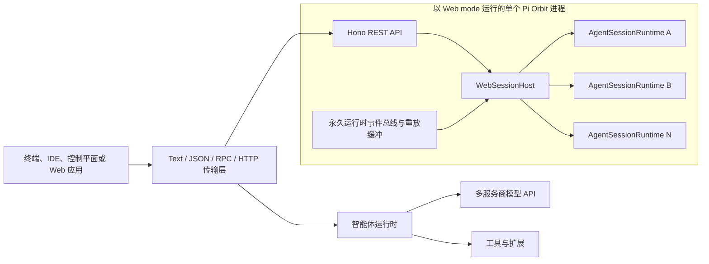

<div align="center">
  <h1>Pi Orbit</h1>
  <p><strong>基于 Pi Agent Harness、聚焦 Runtime Host 的非官方 fork。</strong></p>
  <p>
    你可以交互式运行 Pi，通过 SDK 或 RPC 嵌入 Pi，
    也可以在一个经过认证的 HTTP 运行时宿主中承载多个逻辑隔离的智能体会话。
  </p>
  <p>
    <a href="README.md">English</a>
    · <a href="#快速开始">快速开始</a>
    · <a href="#web-mode">Web Mode</a>
    · <a href="#架构">架构</a>
    · <a href="#开发">开发</a>
  </p>
  <p>
    
    
    
  </p>
</div>

---

> **非官方 fork：** Pi Orbit 是 [Pi Agent Harness](https://github.com/earendil-works/pi) 的独立 fork，与 Mario Zechner 或 Earendil Works 不存在隶属关系，也未获得其官方背书。

Pi Orbit 构建于 Pi 之上。Pi 是一个具备可靠默认能力和开放扩展模型的小型智能体框架，提供智能体循环、模型集成、会话持久化、终端界面、工具和传输层，同时把具体产品工作流交给扩展或宿主应用定义。

本仓库包含面向控制平面和浏览器产品的一等 Web mode。单个 `pi --mode web` 进程可以管理多个逻辑隔离的运行时；每个运行时都拥有独立的 `AgentSessionRuntime`、消息历史、模型状态、工作目录和可重放事件流。

> 新贡献者提交的 Issue 和 Pull Request 会自动关闭并交由维护者审核。详见 [CONTRIBUTING.md](CONTRIBUTING.md)。

## 主要特性

| 领域 | Pi 提供的能力 |
|---|---|
| 编码智能体 | 内置 `read`、`write`、`edit` 和 `bash` 工具，支持模型流式输出 |
| 模型接入 | Anthropic、OpenAI、Google、Bedrock、OpenRouter、本地 OpenAI 兼容端点等 |
| 会话管理 | 持久化历史、分支、派生、上下文压缩、命名、导出和会话树导航 |
| 自定义 | TypeScript 扩展、技能、提示词模板、主题和可安装的 Pi 包 |
| 集成方式 | SDK、JSON 事件、stdin/stdout RPC、REST、WebSocket 和 SSE |
| Web 并发 | 在一个 Pi 进程中管理多个可独立寻址的运行时，并区分运行时 ID 与持久化会话 ID |
| 部署能力 | 可选 Bearer 认证、可配置 CORS、提示请求限流和连接心跳 |

Pi 不强制内置子智能体或计划模式等工作流。你可以通过扩展和技能加入这些能力，也可以将运行时嵌入应用，由应用定义自己的工作流。

## 快速开始

### 环境要求

- Node.js 22.19 或更高版本
- API Key、受支持的服务商订阅，或可信的本地模型端点

### 从源码安装 Pi Orbit

```bash
git clone https://github.com/Garhorne0813/pi-orbit.git
cd pi-orbit
npm ci --ignore-scripts
```

`--ignore-scripts` 会禁用依赖生命周期脚本；Pi Orbit 的常规安装不依赖这些脚本。

配置模型服务商并启动交互式智能体：

```bash
export ANTHROPIC_API_KEY=sk-ant-...
./pi-test.sh
```

你也可以在 Pi 中执行 `/login`，通过受支持的订阅服务商完成认证。

## 运行模式

| 模式 | 命令 | 用途 |
|---|---|---|
| 交互模式 | `pi` 或 `pi --mode text` | 完整终端界面，支持会话、主题、扩展和快捷键 |
| 打印模式 | `pi -p "prompt"` | 执行一次提示，输出最终回复后退出 |
| JSON 模式 | `pi --mode json "prompt"` | 以 JSON Lines 格式输出会话事件 |
| RPC 模式 | `pi --mode rpc` | 通过 stdin/stdout 上的 JSON-Line 协议控制 Pi |
| Web 模式 | `pi --mode web` | 提供 REST API、WebSocket 和 SSE 事件流 |

不同运行模式的详细说明参见[编码智能体指南](packages/coding-agent/README.md)、[JSON 协议](packages/coding-agent/docs/json.md)和 [RPC 协议](packages/coding-agent/docs/rpc.md)。

## Web Mode

Web mode 会把 Pi 转换为本地智能体服务和运行时宿主。一个进程包含一个受保护的启动运行时，默认最多承载 64 个运行时。动态运行时默认空闲 30 分钟后回收，持久化 JSONL 会话仍可显式恢复。

### 启动服务

```bash
export PI_ORBIT_AUTH_TOKEN='replace-with-a-long-random-token'
export PI_ORBIT_CORS_ORIGIN='https://your-control-plane.example'

./pi-test.sh --mode web --web-app-managed --host 127.0.0.1 --port 3000
```

| 设置 | 默认值 | 说明 |
|---|---|---|
| `--host`、`PI_ORBIT_HOST` | `127.0.0.1` | HTTP 监听地址 |
| `--port`、`PI_ORBIT_PORT` | `3000` | HTTP 端口，范围为 1–65535 |
| `--auth-token`、`PI_ORBIT_AUTH_TOKEN` | 未设置 | 进程级 Bearer Token |
| `--web-app-managed`、`PI_ORBIT_APP_MANAGED` | 关闭 | 强制认证，并默认不发送 CORS 许可响应头 |
| `PI_ORBIT_CORS_ORIGIN` | 禁用 | 允许跨域请求的准确浏览器来源 |
| `PI_ORBIT_MAX_RUNTIMES` | `64` | 最大运行时数量，包含启动运行时 |
| `PI_ORBIT_MAX_CONCURRENT_TURNS` | `4` | 所有运行时同时执行的最大模型轮次数 |
| `PI_ORBIT_IDLE_TIMEOUT_MS` | `1800000` | 可恢复持久化运行时的空闲回收时间，单位为毫秒 |
| `PI_ORBIT_REQUEST_BODY_LIMIT_BYTES` | `4194304` | HTTP API 请求体大小上限 |
| `PI_ORBIT_RUNTIME_DISPOSE_TIMEOUT_MS` | `10000` | 单个运行时销毁的最长等待时间 |
| `PI_ORBIT_SHUTDOWN_TIMEOUT_MS` | `15000` | 宿主优雅关闭的最长等待时间 |

健康检查和能力端点无需认证。本地 loopback 开发可以不配置 Token，但只有显式设置 `PI_ORBIT_CORS_ORIGIN` 才会发送 CORS 许可响应头；app-managed 模式即使监听 loopback 也必须配置 Token。绑定到非 loopback 地址时必须同时配置 Bearer Token 和明确的 CORS Origin，否则服务拒绝启动。

### 创建会话并接收事件

```bash
BASE_URL=http://127.0.0.1:3000
AUTH_HEADER="Authorization: Bearer $PI_ORBIT_AUTH_TOKEN"

curl "$BASE_URL/api/health"

SESSION_ID=$(curl -fsS -X POST "$BASE_URL/api/sessions" \
  -H "$AUTH_HEADER" \
  -H "Content-Type: application/json" \
  -d '{"cwd":"/absolute/path/to/project","name":"web session"}' \
  | python3 -c 'import json,sys; print(json.load(sys.stdin)["sessionId"])')

# 发送提示前，在另一个终端中保持此请求运行。
curl -N "$BASE_URL/api/sessions/$SESSION_ID/events" -H "$AUTH_HEADER"
```

发送提示：

```bash
curl -fsS -X POST "$BASE_URL/api/sessions/$SESSION_ID/prompt" \
  -H "$AUTH_HEADER" \
  -H "Content-Type: application/json" \
  -d '{"message":"检查这个项目并总结其架构。"}'
```

提示预检成功后，接口返回 HTTP `202`。随后生成的回复和工具事件会继续通过 SSE 或 WebSocket 推送。预检失败会直接返回错误，不会再被静默接受。

### Runtime Host API

控制平面应使用 `/api/runtimes`。`runtimeId` 是当前 Pi Orbit 进程内的临时运行时句柄；`piSessionId` 是持久化的 Pi 会话身份。会话替换或派生可能改变 `piSessionId`，但不会改变 `runtimeId`。

```bash
RUNTIME=$(curl -fsS -X POST "$BASE_URL/api/runtimes" \
  -H "$AUTH_HEADER" \
  -H "Content-Type: application/json" \
  -d '{
    "cwd":"/absolute/path/to/project",
    "sessionDir":"/absolute/path/to/pi-sessions",
    "runtimeEnv":{"VIRTUAL_ENV":"/absolute/path/to/project/.venv"},
    "skillPolicy":{"mode":"allowlist","skills":["pdf","browser"]}
  }')

RUNTIME_ID=$(printf '%s' "$RUNTIME" | python3 -c 'import json,sys; print(json.load(sys.stdin)["runtimeId"])')
curl -N "$BASE_URL/api/runtimes/$RUNTIME_ID/events" -H "$AUTH_HEADER"
```

| 方法 | 路径 | 用途 |
|---|---|---|
| `GET` | `/api/capabilities` | 协商协议版本和宿主能力 |
| `POST` | `/api/runtimes` | 使用 `cwd` 及可选的会话、环境、模型和 skill policy 配置创建或打开运行时 |
| `GET` | `/api/runtimes` | 列出运行时描述符 |
| `GET` | `/api/runtimes/:runtimeId` | 获取双 ID、路径、活动时间、模型和忙碌状态 |
| `GET` | `/api/runtimes/:runtimeId/health` | 获取运行时健康状态和协议信息 |
| `GET` | `/api/runtimes/:runtimeId/state` | 对账模型、思考级别、会话、队列和忙碌状态 |
| `GET` | `/api/runtimes/:runtimeId/commands` | 列出 extension、prompt template 和 skill 命令 |
| `GET` | `/api/runtimes/:runtimeId/skills` | 列出已发现的 skills、启用状态、诊断和 Runtime policy |
| `PUT` | `/api/runtimes/:runtimeId/skills` | 使用 `inherit`、`none`、`allowlist` 或 `denylist` 替换 Runtime skill policy |
| `POST` | `/api/runtimes/:runtimeId/skills/refresh` | 不重载 extensions、不重启进程，重新扫描 skill 资源 |
| `POST` | `/api/runtimes/:runtimeId/resume` | 恢复显式 `sessionPath`，并可校验 `piSessionId` |
| `POST` | `/api/runtimes/:runtimeId/prompt` | 提交提示，响应同时包含两个 ID |
| `POST` | `/api/runtimes/:runtimeId/steer` | 在活动 turn 中加入 steering 输入 |
| `POST` | `/api/runtimes/:runtimeId/follow-up` | 在活动 turn 中加入 follow-up 输入 |
| `POST` | `/api/runtimes/:runtimeId/abort` | 中止当前轮次 |
| `POST` | `/api/runtimes/:runtimeId/compact` | 压缩当前上下文 |
| `POST` | `/api/runtimes/:runtimeId/fork` | 保留运行时句柄并派生新的 Pi 会话 |
| `POST` | `/api/runtimes/:runtimeId/model` | 精确选择服务商和模型 |
| `POST` | `/api/runtimes/:runtimeId/thinking` | 设置当前模型的思考级别 |
| `POST` | `/api/runtimes/:runtimeId/ui-response` | 通过 HTTP 响应待处理的扩展 UI 请求 |
| `GET` | `/api/runtimes/:runtimeId/events` | 通过 SSE 接收带版本的运行时事件 envelope |
| `DELETE` | `/api/runtimes/:runtimeId` | 销毁动态运行时，但不删除 JSONL 会话 |
| `GET` | `/api/project-trust?cwd=<path>` | 查询项目资源是否需要信任决策 |
| `PUT` | `/api/project-trust` | 持久化 `{ "cwd": "...", "decision": true|false|null }` |

创建请求支持 `provider/modelId` 格式的 `model` 和可选 `thinking`。省略 `sessionDir` 时会继承启动 Runtime 的持久化策略和会话目录。每个 Runtime 永久绑定到规范化后的 `workspaceCwd`；打开或恢复其他 workspace 的会话会返回 `runtime_workspace_mismatch`。`cwdOverride` 表示显式确认迁移，且必须与 `cwd` 解析为同一个 workspace。

Runtime descriptor 除模型状态外，还包含 `workspaceCwd`、`sessionDir`、`persisted`、`skillPolicy` 和资源加载 `diagnostics`。本地 extension、skill 或 prompt template 需要信任决策时，创建接口返回 `project_trust_required`；控制平面完成信任设置后重试。加载错误返回带诊断信息的 `runtime_initialization_failed`，不会注册一个部分可用的 Runtime。

Pi Orbit 定位为单用户共享进程运行时宿主。Provider 凭据、`agentDir`、skill 发现来源、extensions 和 MCP 配置属于应用级资源。每个 Runtime 可以通过 `skillPolicy` 独立过滤已发现的 skill catalog；未知或未受信任的 skill 名称会被拒绝。Policy 更新从下一轮开始生效，`skills/refresh` 用于发现进程启动后新增或删除的文件。服务仍会拒绝 runtime 级原始 `skills` 路径和 `extensions` 字段。`runtimeEnv` 为 Pi 管理的子进程提供 runtime 级覆盖且不会修改 `process.env`；值为 `null` 时删除对应变量。直接创建子进程的第三方 extension 或 MCP adapter 必须自行合并 runtime 环境。

每个持久化 session path 和 `piSessionId` 只能由一个 Runtime 持有，冲突返回 HTTP 409 和 `session_in_use`。Prompt 与排他生命周期操作使用不同租约：活动 turn 中仍可调用 `steer`、`follow-up`、abort 控制和 UI response；第二个 prompt、resume、compact、fork、restart 或 delete 返回 `runtime_busy`。不同 Runtime 仍可在进程级 turn 并发限制内并行执行。

### 会话 API

| 方法 | 路径 | 用途 |
|---|---|---|
| `POST` | `/api/sessions` | 使用可选的 `cwd` 和 `name` 创建会话 |
| `GET` | `/api/sessions` | 列出当前进程管理的会话 |
| `GET` | `/api/sessions/:id` | 获取会话元数据 |
| `GET` | `/api/sessions/:id/state` | 获取模型、思考级别、流式和压缩状态 |
| `GET` | `/api/sessions/:id/stats` | 获取消息、Token、成本和上下文统计 |
| `GET` | `/api/sessions/:id/messages` | 获取当前消息历史 |
| `GET` | `/api/sessions/:id/entries?since=<id>` | 获取全部或增量会话条目 |
| `GET` | `/api/sessions/:id/tree` | 获取会话分支树和当前叶节点 |
| `GET` | `/api/sessions/:id/commands` | 获取扩展、提示模板和技能命令 |
| `GET` | `/api/sessions/:id/fork-messages` | 获取可作为派生点的用户消息 |
| `GET` | `/api/sessions/:id/last-assistant-text` | 获取最后一条助手文本 |
| `PATCH` | `/api/sessions/:id` | 使用 `{ "name": "..." }` 重命名会话 |
| `POST` | `/api/sessions/:id/switch` | 切换到 `{ "sessionPath": "...", "cwdOverride": "..." }` 指定的会话 |
| `POST` | `/api/sessions/:id/clone` | 在当前活动叶节点克隆会话 |
| `POST` | `/api/sessions/:id/restart` | 重建运行时，同时保持 Web 会话 ID 不变 |
| `POST` | `/api/sessions/:id/export` | 将持久化会话导出为 HTML |
| `DELETE` | `/api/sessions/:id` | 销毁动态会话 |

启动时创建的默认会话不能删除。如果需要替换其运行时，请调用 `restart` 端点。

### 智能体与模型 API

| 方法 | 路径 | 用途 |
|---|---|---|
| `POST` | `/api/sessions/:id/prompt` | 提交 `{ "message": "..." }` |
| `POST` | `/api/sessions/:id/steer` | 将 `{ "message": "...", "images": [...] }` 加入 steering 队列 |
| `POST` | `/api/sessions/:id/follow-up` | 将消息加入当前轮次后的 follow-up 队列 |
| `POST` | `/api/sessions/:id/abort` | 中止当前智能体运行 |
| `POST` | `/api/sessions/:id/abort-bash` | 中止当前直接执行的 bash 命令 |
| `POST` | `/api/sessions/:id/abort-retry` | 中止自动重试等待 |
| `POST` | `/api/sessions/:id/bash` | 执行 shell 命令并返回结果 |
| `POST` | `/api/sessions/:id/compact` | 压缩上下文并返回压缩结果 |
| `POST` | `/api/sessions/:id/fork` | 在可选的 `entryId` 处派生会话 |
| `GET` | `/api/models?session_id=<id>` | 列出已配置认证的模型 |
| `POST` | `/api/sessions/:id/model` | 精确选择 `{ "provider": "...", "modelId": "..." }` |
| `POST` | `/api/sessions/:id/cycle-model` | 向前或向后循环切换模型 |
| `POST` | `/api/sessions/:id/thinking` | 设置 `off`、`minimal`、`low`、`medium`、`high` 或 `xhigh` |
| `POST` | `/api/sessions/:id/cycle-thinking` | 循环切换当前模型支持的思考级别 |
| `GET` | `/api/sessions/:id/thinking-levels` | 获取当前模型支持的思考级别 |
| `PUT` | `/api/sessions/:id/steering-mode` | 将队列模式设为 `all` 或 `one-at-a-time` |
| `PUT` | `/api/sessions/:id/follow-up-mode` | 设置 follow-up 队列模式 |
| `PUT` | `/api/sessions/:id/auto-compaction` | 开启或关闭自动压缩 |
| `PUT` | `/api/sessions/:id/auto-retry` | 开启或关闭自动重试 |

提示请求使用按会话划分的 Token Bucket 进行限流，当前默认值为每分钟 30 次。

### 事件传输

旧版 session 传输接口提供序列化的 `AgentSessionEvent`：

- SSE：`GET /api/sessions/:id/events`
- WebSocket：`GET /ws?session_id=<id>`

运行时宿主使用 `GET /api/runtimes/:runtimeId/events`。事件订阅在运行时创建时建立，而不是在客户端连接时建立；每个事件都包含 `protocolVersion`、`runtimeId`、`piSessionId`、单调递增的 `sequence` 和 `timestamp`。回放窗口校验、实时订阅注册和回放快照是原子操作，每个 SSE 客户端的写入也会串行执行。客户端可以传入 `Last-Event-ID` 或 `?after=<sequence>` 重放内存环形缓冲。HTTP 409 和 `event_replay_gap` 表示请求序号已过期，`event_sequence_ahead` 表示请求序号超前；两者都要求控制平面从运行时状态重新对账。

面向个人桌面控制平面时，一个启用认证的 Pi Orbit 进程可以在同一用户或信任域内承载多个 workspace Runtime。进程监督、事件持久化、产品特有的 artifact 观察以及进程重启后的 `piSessionId -> runtimeId` 对账仍由控制平面负责。只有 workspace 需要不同信任边界、凭据或 OS 级隔离时才拆分进程。若 fork 时必须保留源 Runtime，应先用源 `sessionPath` 创建第二个 Runtime，再在第二个 Runtime 上执行 fork；`/api/runtimes/:runtimeId/fork` 会有意切换现有 Runtime 所持有的 Pi session。

WebSocket 客户端还可以发送提示命令：

```json
{ "type": "prompt", "message": "运行相关测试。" }
```

客户端也可以用 `{ "type": "abort" }` 中止当前智能体运行。扩展调用 `ctx.ui` 时，会通过同一连接发送限定在当前 session 的 `extension_ui_request`；客户端使用 `extension_ui_response` 响应阻塞式对话框。通知、状态、标题、编辑器文本和字符串数组 widget 无需响应。完整格式参见 [Web mode 协议](packages/coding-agent/docs/web-mode.md#extension-ui-protocol)。

经过认证的 WebSocket 升级请求必须通过 HTTP Header 携带 `Authorization: Bearer <token>`。服务器会拒绝 URL query 中的 Token。Node 客户端和 `websocat` 等命令行客户端可以直接设置 Header：

```bash
websocat -H="Authorization: Bearer $PI_ORBIT_AUTH_TOKEN" \
  "ws://127.0.0.1:3000/ws?session_id=$SESSION_ID"
```

浏览器原生 `WebSocket` 和 `EventSource` API 无法设置任意认证 Header。可以先换取一次同源 HttpOnly Cookie，再使用浏览器原生传输，且无需把 Token 放入 URL：

```bash
curl -i -X POST "$BASE_URL/api/auth/session" -H "$AUTH_HEADER"
```

响应会设置带 `HttpOnly` 和 `SameSite=Strict` 的 `pi_web_auth`。后端或桌面壳层应负责执行这次交换，避免 Bearer Token 进入浏览器 JavaScript；`DELETE /api/auth/session` 可清除此 Cookie。

## 架构



Web mode 是构建在 `AgentSession` 之上的传输层，交互模式和 RPC 模式同样使用该会话核心。`WebSessionHost` 管理进程内运行时注册表、容量限制、活动时间和空闲回收；`ConnectionManager` 永久订阅每个运行时，在有限环形缓冲中保持事件顺序，并在运行时替换底层 Pi 会话后重新绑定事件流。

会话隔离是逻辑隔离，不是操作系统安全边界。不同会话具有独立运行时状态，但共享 Pi 进程、环境变量、Provider 凭据、智能体资源、文件系统权限和网络访问能力。本模式面向单用户、单信任域，不适合互不信任的租户。

## 软件包

| 软件包 | 说明 |
|---|---|
| [@earendil-works/pi-ai](packages/ai) | 统一的多服务商 LLM API |
| [@earendil-works/pi-agent-core](packages/agent) | 智能体循环、工具调用、事件和状态管理 |
| [@earendil-works/pi-coding-agent](packages/coding-agent) | CLI、会话、工具、扩展、RPC 和 Web mode |
| [@earendil-works/pi-tui](packages/tui) | 使用差分渲染的终端 UI 库 |

编码智能体包还提供 SDK，应用可以直接嵌入 Pi，而不必启动传输服务。详见 [SDK 文档](packages/coding-agent/docs/sdk.md)。

## 安全与部署

Pi 使用启动它的操作系统用户权限运行。Web Token 用于认证整个进程，不提供会话级授权，也不会对工具执行进行沙箱隔离。

生产环境部署建议：

- 始终配置一个足够长且随机的 `PI_ORBIT_AUTH_TOKEN`。
- 除非可信网络路径确有需要，否则只监听 localhost。
- 在反向代理处终止 TLS 并限制请求体大小。
- 将 `PI_ORBIT_CORS_ORIGIN` 设置为准确的控制平面来源。
- 为互不信任的用户运行不同的 Pi 进程或容器。
- 在 Pi 外部施加 CPU、内存、文件系统和网络限制。
- 将 bash 端点和智能体工具视为 Pi 信任域内的远程代码执行能力。

服务器每 30 秒向 WebSocket 客户端发送一次 ping，并终止不再响应的连接。事件发送失败时只关闭对应连接。运行时句柄和重放缓冲保存在内存中。只有会话文件已经实际落盘的持久化运行时才会被空闲回收；内存会话和尚未写入 JSONL 的会话不会自动回收。卡住的运行时销毁和宿主关闭受可配置期限约束。

Gondolin、Docker 和 OpenShell 隔离方式参见[容器化指南](packages/coding-agent/docs/containerization.md)。将 Pi 暴露到本地信任边界以外之前，请先阅读 [SECURITY.md](SECURITY.md)。

## 开发

如果尚未完成[快速开始](#快速开始)，请克隆仓库并安装锁定的工作区依赖：

```bash
git clone https://github.com/Garhorne0813/pi-orbit.git
cd pi-orbit
npm ci --ignore-scripts
```

常用命令：

```bash
npm run check        # 格式化、Lint、依赖检查和 TypeScript 检查
./test.sh            # 非端到端测试套件
./pi-test.sh         # 直接从源码运行 Pi
./pi-test.sh --mode web --port 3000
```

构建和完整测试命令与 `npm run check` 相互独立：

```bash
npm run build
npm test
```

仓库开发规则参见 [AGENTS.md](AGENTS.md)，贡献者门槛和审查流程参见 [CONTRIBUTING.md](CONTRIBUTING.md)。

## 供应链加固

- 直接外部依赖锁定为精确版本。
- 除非生命周期脚本已明确审查，否则本地安装和 CI 均使用 `--ignore-scripts`。
- `package-lock.json` 是依赖版本的唯一依据。
- 发布的 coding-agent 包包含生成的 shrinkwrap，用于锁定传递依赖。
- `npm run check` 会验证依赖锁定、TypeScript import、shrinkwrap 和安装锁。
- 发布冒烟测试会先在仓库外安装未发布的 Node 和 Bun 产物，再创建版本标签。

## 文档

- [编码智能体指南](packages/coding-agent/README.md)
- [Web mode 协议](packages/coding-agent/docs/web-mode.md)
- [Web mode 通用性整改记录](packages/coding-agent/docs/pi-orbit-generality-remediation.md)
- [RPC 协议](packages/coding-agent/docs/rpc.md)
- [模型服务商配置](packages/coding-agent/docs/providers.md)
- [扩展](packages/coding-agent/docs/extensions.md)
- [技能](packages/coding-agent/docs/skills.md)
- [容器化](packages/coding-agent/docs/containerization.md)

上游 Pi 项目的网站和版本化文档位于 [pi.dev](https://pi.dev) 和 [pi.dev/docs/latest](https://pi.dev/docs/latest)。

## 参与贡献

欢迎提交 Issue 和 Pull Request。运行时行为变更应包含对应的回归测试。提交前请执行 [CONTRIBUTING.md](CONTRIBUTING.md) 要求的检查。

长期设计工作记录在 [Pi RFC](https://rfc.earendil.com/keyword/pi/) 中。

## 致谢

Pi Orbit 构建于 [Pi Agent Harness](https://github.com/earendil-works/pi) 之上。该项目由 [Mario Zechner](https://github.com/badlogic) 创建，并由 Earendil Works 及其贡献者维护。

本 fork 保留上游 MIT 许可证和版权声明。Pi Orbit 由独立维护者维护，不是 Pi 的官方发行版。

## 许可证

MIT

上游版权声明和许可证条款参见 [LICENSE](LICENSE)。
